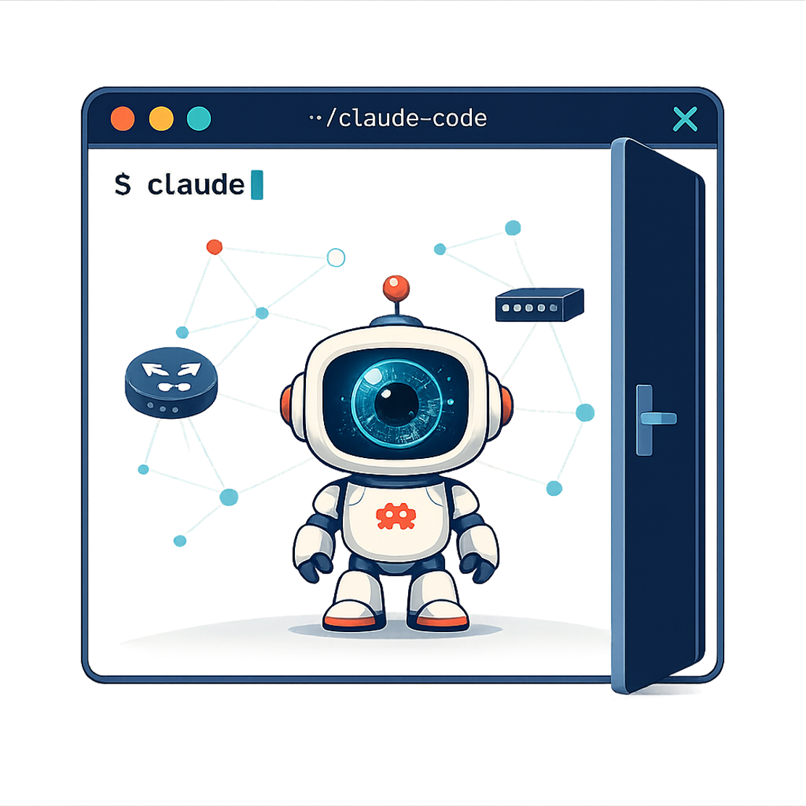

# IRIS

<p align="center">
  
</p>

IRIS is a network operations agent built as a Claude Code skill. The idea is simple: a network engineer still owns every decision, but a lot of the work around those decisions (pulling device state, checking it against source of truth, running pre-condition checks, drafting the change, verifying it after, writing it up in the ticket) is the kind of thing an agent can do well if you give it the right discipline.

That discipline is what's in this repo.

## What's in the repo

```
.
├── SKILL.md                    the workflow IRIS follows on every ticket
├── CLAUDE.md                   operating rules for the agent
├── .claude/commands/iris.md    /iris slash command entry point
├── .mcp.json.example           template for the tools IRIS connects to
├── environment/
│   ├── discovery/              where IRIS learns your network
│   │   ├── docs/               drop network docs, diagrams, IaC here
│   │   └── scripts/            drop executable discovery scripts here
│   └── artifacts.md.template   what IRIS writes after first-run discovery
├── automation/
│   ├── scripts/                your operational automation lives here
│   └── artifacts.md.template   IRIS catalogs each artifact it learns
└── references/
    ├── learn-environment.md    how IRIS does first-run discovery
    ├── learn-automation.md     how IRIS learns a new automation artifact
    └── pre-change-checks.md    pre-condition checks by change type
```

### The pieces

`SKILL.md` is the heart of it. It's the workflow IRIS runs on every ticket: discover, verify, propose, confirm, execute, verify, document. The discipline doesn't change whether you're touching Catalyst CLI, the Meraki dashboard, or a Terraform plan.

`CLAUDE.md` is the operating contract. Don't push without explicit approval. Stop if something looks wrong. Close the ticket with enough detail that the next engineer can reconstruct what happened and why.

`environment/` is where IRIS learns what your network looks like. On first run it pulls from any MCPs you've connected, reads whatever docs you've dropped into `discovery/docs/`, and runs any scripts in `discovery/scripts/`. The result lands in `environment/artifacts.md`, which IRIS treats as its environment context going forward.

`automation/` is your toolbelt. Drop scripts or playbooks into `automation/scripts/` and IRIS will read them, install missing dependencies, and write a summary into `automation/artifacts.md`. Each artifact gets a safety classification. Read-only artifacts can run during investigation without approval. State-changing artifacts always require explicit approval before they run, the same as any other change.

`references/` is the deeper reading. The pre-change checks file is the one IRIS pulls from most — it has common pre-condition patterns by change type (BGP changes, ACL edits, VLAN moves, etc.).

## Getting started

### 1. Clone

```bash
git clone <your-fork-url> ~/iris
cd ~/iris
```

### 2. Connect your tools

Copy the MCP template and fill in your own endpoints and credentials:

```bash
cp .mcp.json.example .mcp.json
```

Edit `.mcp.json` with the URLs, usernames, tokens, and passwords for whatever you want IRIS to reach. The template ships with entries for ServiceNow, NetBox, and CML. Keep what applies, delete what doesn't, add what you need.

`.mcp.json` is gitignored. It does not get pushed.

You don't need every category of tool, but the more categories you connect, the more IRIS can do. A useful starting set looks like this:

| Category | Examples |
|---|---|
| Ticketing | ServiceNow, Jira |
| Device management | CML, Meraki, Catalyst Center, direct CLI |
| Source of truth | NetBox |
| Observability | Splunk, ThousandEyes |

### 3. Add discovery sources (optional but recommended)

If you have network documentation, drop it into `environment/discovery/docs/`. Markdown, PDFs, diagrams, Terraform, Ansible — IRIS reads what's there. Two example site files ship in the repo so you can see the shape; replace them with your own or delete them.

If you have working discovery scripts, put them into `environment/discovery/scripts/`. They run during first-time initialization and IRIS reads their output.

### 4. Add automation (optional)

Drop any operational scripts you want IRIS to use into `automation/scripts/`. The first time IRIS sees a new file there, it will offer to learn it before doing anything else with it.

### 5. Run it

In Claude Code, from inside the repo:

```
/iris work ticket INC0012345
```

Or just describe what you want it to do — investigate a device, validate a config change, check a BGP session. The skill triggers on operational language even without the slash command.

On first run, IRIS notices that `environment/artifacts.md` is still the placeholder template and runs discovery before doing anything else. After that, normal workflow.

## How IRIS handles a change

The short version of `SKILL.md`:

1. Restate the ticket in plain language and confirm before touching anything.
2. Discover. Query the devices, the source of truth, the surrounding topology. Don't assume.
3. Validate pre-conditions. Confirm the things the change depends on are actually true. If a check fails, stop and surface it.
4. Propose. Exact commands, exact API calls, expected outcome, verification plan. Wait for explicit approval.
5. Execute only what was approved. Nothing batched alongside it.
6. Verify. Fresh queries after the change. Confirm operational state matches intent.
7. Document. Update the ticket with what was discovered, what was done, and what was verified.

## A few things IRIS won't do

It won't push a change without explicit approval. It won't skip pre-condition checks because something is urgent. If execution fails, it stops and tells you instead of trying to recover on its own, and it won't mark a ticket resolved until verification has actually run. If a tool you'd expect it to use isn't connected, it'll say so rather than guess.

## License

MIT — see [LICENSE](LICENSE).

## Credits

Built by Kareem Iskander as a Claude Code skill.
