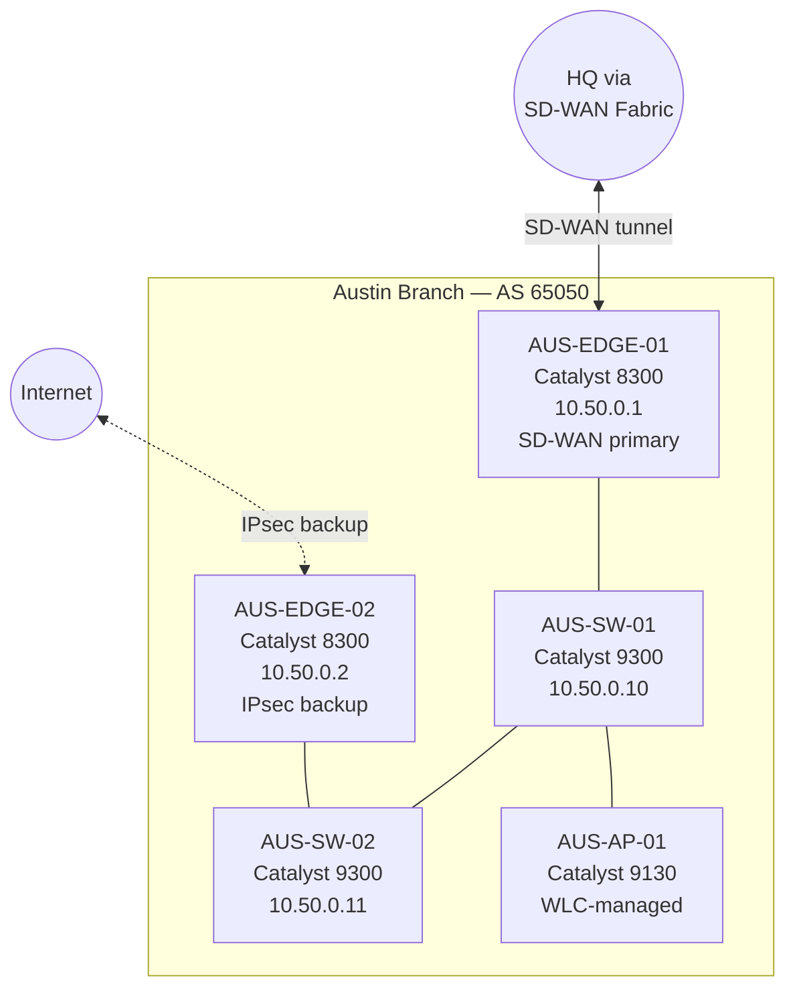

# Branch Site: Austin (AUS-01)

**Site code:** AUS
**Location:** Austin, TX — 200 W 6th St, Floor 14
**Type:** Branch office, ~80 users
**Primary contact:** austin-it@company.local
**Change window:** Tuesdays 10PM–2AM CT

## Purpose

Sales and customer success team. Connects back to HQ over SD-WAN with a backup IPsec path over commodity internet. Low-complexity site — no on-prem servers, no production workloads.

## Topology

## Device Inventory

| Hostname    | Role                    | Platform      | Management IP | Notes                          |
|-------------|-------------------------|---------------|---------------|--------------------------------|
| AUS-EDGE-01 | SD-WAN edge (primary)   | Catalyst 8300 | 10.50.0.1     | Primary path to HQ             |
| AUS-EDGE-02 | SD-WAN edge (secondary) | Catalyst 8300 | 10.50.0.2     | Backup path over commodity ISP |
| AUS-SW-01   | Access switch           | Catalyst 9300 | 10.50.0.10    | Primary distribution           |
| AUS-SW-02   | Access switch           | Catalyst 9300 | 10.50.0.11    | Secondary distribution         |
| AUS-AP-01   | Wireless AP             | Catalyst 9130 | DHCP from WLC | Managed by HQ WLC              |

## Addressing

| Prefix         | Purpose                              |
|----------------|--------------------------------------|
| 10.50.0.0/24   | Infrastructure management            |
| 10.50.10.0/24  | Corporate users (VLAN 10)            |
| 10.50.20.0/24  | Guest wireless (VLAN 20)             |
| 10.50.30.0/24  | VoIP phones (VLAN 30)                |
| 10.50.99.0/30  | WAN transit to SD-WAN fabric         |

## Routing

- **AS:** 65050 (private ASN for branch)
- **Default route:** injected via SD-WAN BGP session, prefers primary path
- Backup IPsec activates automatically if primary SD-WAN tunnel drops

## Known Quirks

- AUS-SW-02 had power supply issues twice in the past year. Currently on secondary PSU. Replacement scheduled for next quarter.
- The WLC managing AUS-AP-01 lives at HQ — if the SD-WAN tunnel flaps, APs go offline until it recovers. Known limitation, accepted by business.
- VLAN 30 (VoIP) uses DHCP option 150 pointing at the HQ CUCM cluster. Do not change DHCP scope without coordinating with Unified Comms team.

## Escalation

- L1/L2 support: branch-support@company.local
- SD-WAN fabric issues: sdwan-noc@company.local (24x7)
- Emergency: on-call phone in ServiceNow
