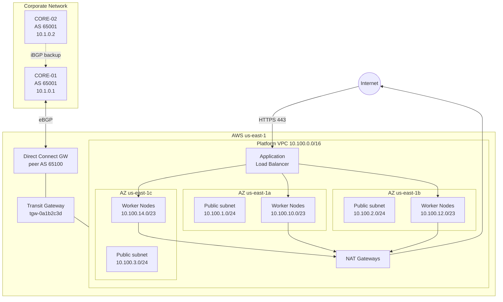

# Kubernetes Platform: platform-eks-prod

**Cluster:** platform-eks-prod
**Region:** us-east-1
**Purpose:** Production EKS cluster running the Platform team's customer-facing services
**Owner:** platform-sre@company.local
**On-call:** PagerDuty rotation `platform-sre`

## Topology

## AWS Network Layout

| Resource            | Value / CIDR                       | Notes                               |
|---------------------|------------------------------------|-------------------------------------|
| VPC                 | platform-eks-prod                  | 10.100.0.0/16                       |
| Public subnets      | 10.100.1.0/24, .2.0/24, .3.0/24    | ALBs, NAT gateways                  |
| Private subnets     | 10.100.10.0/23, .12.0/23, .14.0/23 | Worker nodes                        |
| Pod CIDR (VPC CNI)  | uses private subnets               | No overlay — pods get VPC IPs       |
| Service CIDR        | 172.20.0.0/16                      | ClusterIP, not routable outside EKS |

## Connectivity

- **To corporate network:** via Transit Gateway → Direct Connect → CORE-01. Corporate side advertises 10.0.0.0/8 to the cluster.
- **Internet ingress:** ALBs in public subnets, targets are pods via AWS Load Balancer Controller in IP mode.
- **Internet egress:** NAT gateways per AZ. Worker nodes have no direct internet.

## Cluster Profile

- **EKS version:** 1.29
- **Node groups:** 3 managed groups across 3 AZs, ~40 nodes steady state, auto-scaling to ~80 under load
- **Workloads:** ~120 deployments across 18 namespaces
- **Ingress controller:** AWS Load Balancer Controller
- **Service mesh:** Istio (ambient mode)
- **DNS:** external-dns writing to Route53 zone `platform.company.com`

## Known Quirks

- **Pod IPs from VPC CIDR.** VPC CNI in native mode means every pod gets a real VPC IP. Pod density per node capped by ENI limits. m6i.2xlarge caps at ~58 pods/node.
- **Cross-AZ traffic is not free.** $0.01/GB. Services that chatter a lot (Kafka, Redis) use topology-aware routing to prefer in-AZ.
- **Transit Gateway route-limit quirk.** Hit the /22 limit in 2024 when too many VPCs were attached. Current count is fine but monitor if we keep adding spokes.
- **external-dns lag.** DNS changes propagate within ~60 seconds, but can take up to 5 minutes during control plane pressure. Do not assume instant cutover.

## Escalation

- **Platform SRE:** platform-sre@company.local, PagerDuty `platform-sre`
- **Network team:** netops@company.local (for DX, TGW, or routing)
- **AWS TAM:** open a ticket via AWS console for AWS-side issues
